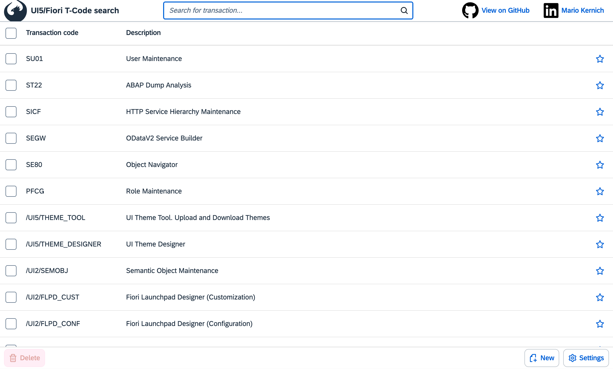

# T-Code Quick Finder


Welcome to the UT-Code Quick Finder project. This application provides a fast and efficient way to search for transaction codes (T-Codes). A live demo is available at [tcodes.kernich.de](https://tcodes.kernich.de).



## Overview

This project demonstrates a TypeScript setup for developing UI5 applications. It is designed to help developers quickly find and manage T-Codes necessary for UI5 and Fiori projects. The application includes features such as search functionality, copy to clipboard, favorite management with local storage, and more.

## Features

- **Search Functionality**: Quickly search for T-Codes by their code or description.
- **Copy to Clipboard**: Easily copy T-Codes to the clipboard by clicking on a table row.
- **Favorite Management**: Mark T-Codes as favorites and sort them for easy access. Favorites are stored in local storage.
- **Add Custom T-Codes**: Add your own T-Codes with descriptions.
- **Delete T-Codes**: Delete selected T-Codes from the list.
- **Reset to Factory Defaults**: Reset the T-Code list to the default set of T-Codes.
  
## Demo

A live demo of the application can be accessed at [tcodes.kernich.de](https://tcodes.kernich.de).

## Requirements

- [npm](https://www.npmjs.com/) or [yarn](https://yarnpkg.com/) for dependency management.

## Installation

To install the dependencies, run:

```sh
npm install
```

Or, if you prefer yarn:

```sh
yarn
```

## Running the App

To run the app locally for development in watch mode (the browser reloads the app automatically when there are changes in the source code), execute:

```sh
npm start
```

Or, with yarn:

```sh
yarn start
```

The app will be available at [http://localhost:8080/index.html](http://localhost:8080/index.html).

## Debugging

In the browser, you can directly debug the original TypeScript code, which is supplied via sourcemaps. If the browser doesn't automatically jump to the TypeScript code when setting breakpoints, use `Ctrl`/`Cmd` + `P` in Chrome to open the `*.ts` file you want to debug.

## Building the App

### Unoptimized Build

To build the project and get an app that can be deployed, run:

```sh
npm run build
```

The result is placed into the `dist` folder. To start the generated package, run:

```sh
npm run start:dist
```

Or, with yarn:

```sh
yarn build
yarn start:dist
```

### Optimized Build

For an optimized self-contained build, run:

```sh
npm run build:opt
```

To start the generated package, run:

```sh
npm run start:dist
```

Or, with yarn:

```sh
yarn build:opt
yarn start:dist
```

## Code Quality

To run a TypeScript check, execute:

```sh
npm run ts-typecheck
```

To lint the TypeScript code, execute:

```sh
npm run lint
```

Or, with yarn:

```sh
yarn ts-typecheck
yarn lint
```

## License

This project is licensed under the Apache Software License, version 2.0. See the [LICENSE](LICENSE) file for more details.

## Contact

For more information, please contact [Mario Kernich](https://www.linkedin.com/in/mario-kernich/).

---

Thank you for checking out the UI5/Fiori T-Code Quick Search project. We hope you find it useful for your UI5 and Fiori development needs.
