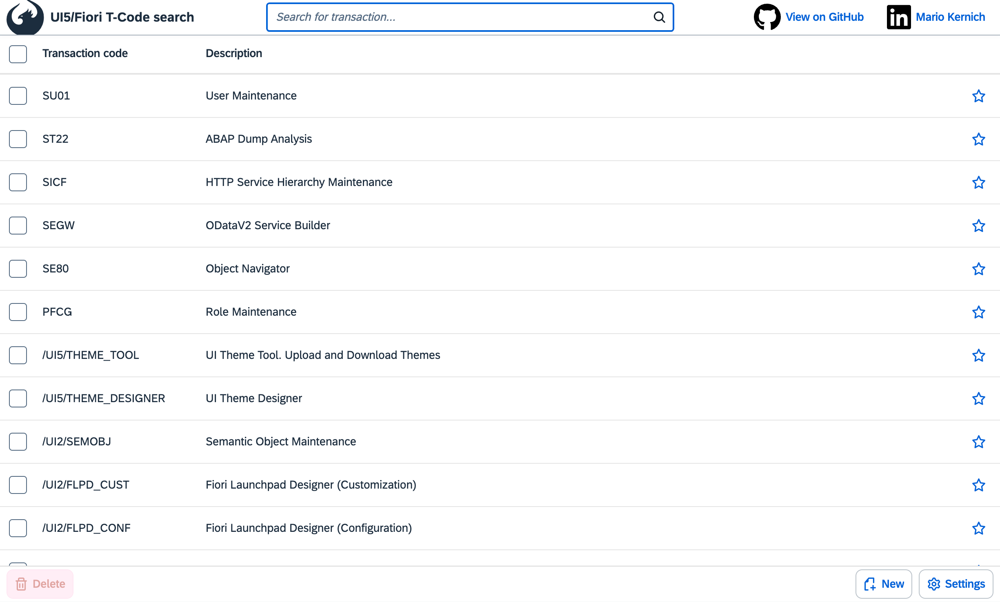

[](https://github.com/mariokernich/ui5-tcode-finder/actions/workflows/ci.yml)

Welcome to the T-Code Quick Finder project. This application provides a fast and efficient way to search for transaction codes (T-Codes). A live demo is available at [tcodes.kernich.de](https://tcodes.kernich.de).



## Overview

This project is designed to help developers quickly find and manage T-Codes necessary for UI5 and Fiori projects. The application includes features such as search functionality, copy to clipboard, favorite management, custom T-Codes and more.

## Features

- **Search Functionality**: Quickly search for T-Codes by their code, title, or description. The search works together with the group tabs.
- **Copy to Clipboard**: Easily copy T-Codes to the clipboard by clicking on a table row.
- **Copy behavior**: Just copy the T-Code, add an /n or /o prefix (/o while the Shift key is pressed) or open them directly in SAP GUI for HTML (WebGUI).
- **Favorite Management**: Mark T-Codes as favorites to keep them at the top of the list.
- **Recently Used**: The RECENT tab lists the 20 T-Codes you copied or opened last.
- **Add Custom T-Codes**: Add your own T-Codes with descriptions in the CUSTOM group. Use the right click context menu to edit existing ones.
- **Theme Selection**: Choose between light, dark or the theme of your operating system.
- **Group Visibility**: Select which groups of transactions are displayed.
- **Import/Export**: Transfer your settings, favorites and custom T-Codes to another browser.
- **Offline Use**: Install the app from your browser (progressive web app); it works without an internet connection and offers new versions for reload.
- **English and German**: The user interface uses German if your browser prefers it and English otherwise. The URL parameter `sap-ui-language=de` or `sap-ui-language=en` overrides this.
- **Responsive Design**: Optimized for both desktop and mobile devices.

Favorites, custom and recently used T-Codes are stored in the IndexedDB and the settings in the local storage of your browser. No data is sent to a server. The UI5 framework is part of the app, no third-party CDN is involved.

## Demo

A live demo of the application can be accessed at [tcodes.kernich.de](https://tcodes.kernich.de).

## Requirements

- [Node.js](https://nodejs.org/) 22.13 or later, version 24 (LTS) is recommended, see [.nvmrc](.nvmrc)
- [npm](https://www.npmjs.com/) for dependency management

## Installation

To install the dependencies, run:

```sh
npm install
```

## Running the App

To run the app locally for development in watch mode (the browser reloads the app automatically when there are changes in the source code), execute:

```sh
npm start
```

The app will be available at [http://localhost:8080/index.html](http://localhost:8080/index.html).

## Debugging

In the browser, you can directly debug the original TypeScript code, which is supplied via sourcemaps. If the browser doesn't automatically jump to the TypeScript code when setting breakpoints, use `Ctrl`/`Cmd` + `P` in Chrome to open the `*.ts` file you want to debug.

## Building the App

To build the app that is deployed, run:

```sh
npm run build
```

The build is self-contained: it bundles the app with the required parts of OpenUI5 into `dist/resources/sap-ui-custom.js` and contains the other framework files the app may load, like themes and message bundles. Afterwards, [prune-build.mjs](scripts/prune-build.mjs) removes files that are never requested at runtime, like debug sources and theme sources, and [generate-service-worker.mjs](scripts/generate-service-worker.mjs) creates the service worker for offline use. The build reports missing modules of the UI5 support tools, which the app does not need.

To start the built app, run:

```sh
npm run start:dist
```

It is available at [http://localhost:8090/index.html](http://localhost:8090/index.html). The service worker is only registered by the built app, the development server always serves the current sources. It uses its own port because a service worker controls all pages of its origin.

## Code Quality

| Command               | Description                                      |
| --------------------- | ------------------------------------------------ |
| `npm run lint`        | Lint the TypeScript code with ESLint             |
| `npm run typecheck`   | Check the types with the TypeScript compiler     |
| `npm run ui5lint`     | Check the app for deprecated or unsafe UI5 usage |
| `npm run test:ui5`    | Run the unit and integration tests with coverage |
| `npm test`            | Run all of the above                             |

The unit tests (QUnit) and the integration tests (OPA5) can also be run in the browser: start the app with `npm start` and open [http://localhost:8080/test/testsuite.qunit.html](http://localhost:8080/test/testsuite.qunit.html). On its first run, the [UI5 Test Runner](https://github.com/ArnaudBuchholz/ui5-test-runner) installs [Puppeteer](https://pptr.dev/) globally to control a headless browser.

## UI5 Version

The app uses the long-term maintenance version OpenUI5 1.148, see the [version overview](https://sdk.openui5.org/versionoverview.html). The development server, the tests and the build use the version of [ui5.yaml](ui5.yaml). When updating the version, change it consistently in [ui5.yaml](ui5.yaml), [ui5-coverage.yaml](ui5-coverage.yaml), [manifest.json](webapp/manifest.json) (`minUI5Version`) and the `@openui5/types` dependency.

## Deployment

Every push to the `main` branch is deployed to [tcodes.kernich.de](https://tcodes.kernich.de) by the [CI workflow](.github/workflows/ci.yml) after linting, type checking, testing and building succeeded.

## License

This project is licensed under the Apache Software License, version 2.0. See the [LICENSE](LICENSE) file for more details.

## Contact

For more information, please contact [Mario Kernich](https://www.linkedin.com/in/mariokernich).

---

Thank you for checking out the UI5/Fiori T-Code Quick Search project. We hope you find it useful for your UI5 and Fiori development needs.
